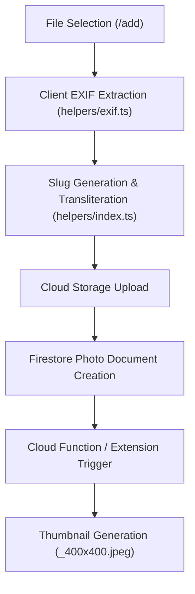

# AGENTS.md

This file provides comprehensive guidance for AI agents and developers working with the **Andrejevici** codebase.

---

## 🎯 Project Overview

**Andrejevici** is a modern Progressive Web App (PWA) photo and video album application designed for browsing, uploading, tagging, searching, and managing media assets with automated EXIF metadata extraction, bi-lingual search transliteration, and administrative permissions control.

### Core Tech Stack

| Layer                      | Technology                                                                                      |
| :------------------------- | :---------------------------------------------------------------------------------------------- | --- | --- | --- | --- | --- | ----- |
| **Frontend Framework**     | **Next.js 16** (App Router) + **React 19**                                                      |
| **Language**               | **TypeScript 5.9** (Strict Mode)                                                                |
| **Styling & UI**           | **Tailwind CSS 4** + **Headless UI** (`@headlessui/react`) + **Heroicons** (`@heroicons/react`) |
| **State Management**       | **Zustand 5** (Modular slice architecture)                                                      |
| **Backend Infrastructure** | **Firebase 11** (Firestore, Cloud Storage, Authentication, Cloud Functions, Cloud Messaging)    |
| **Media & EXIF**           | **ExifReader** (client-side metadata extraction) + `yet-another-react-lightbox`                 |
| **Build & PWA**            | Webpack + Workbox Build 7 + Custom Service Worker (`public/sw.js`)                              |
| **Package Manager**        | **npm** (`node` engine: `^24                                                                    |     | ^22 |     | ^20 |     | ^18`) |

---

## 🚀 Quick Start & CLI Reference

### Environment Setup

```bash
npm install                    # Install dependencies
./ands run                     # Start Firebase emulators with persistent state in ./data
npm run dev                    # Start Next.js dev server on http://localhost:3000 (Terminal 2)
```

### Master Helper Script (`./ands`)

The [`./ands`](./ands) helper script centralizes project operations:

| Command            | Category    | Action / Description                                                                                                           |
| :----------------- | :---------- | :----------------------------------------------------------------------------------------------------------------------------- |
| `./ands run`       | **Backend** | Starts Firebase emulators (Auth: 9099, Firestore: 8080, Storage: 9199, Functions: 5001, UI: 4000) with `./data` import/export. |
| `./ands build`     | **Build**   | Injects timestamp (`NEXT_PUBLIC_BUILD`) into `.env` and compiles Next.js frontend & PWA bundle.                                |
| `./ands deploy`    | **Deploy**  | Deploys client application to Firebase Hosting.                                                                                |
| `./ands indexes`   | **Deploy**  | Deploys Firestore index configurations (`firestore.indexes.json`) to Cloud Firestore.                                          |
| `./ands functions` | **Backend** | Compiles TypeScript source for `functionNotify`, `functionCron`, `functionThumb` and deploys Cloud Functions.                  |
| `./ands icons`     | **Assets**  | Re-generates application icons from `AppIcon.svg` via `node scripts/build-icons.js`.                                           |
| `./ands test`      | **Quality** | Executes TypeScript unit tests (`npm test test/slug.ts`).                                                                      |

### NPM Scripts Reference

- `npm run dev` — Launch Next.js dev server with HMR.
- `npm run dev:pwa` — Build PWA service worker script and start dev server with `NEXT_PUBLIC_PWA_DEV=true`.
- `npm run build` — Compile Next.js bundle and generate PWA service worker via `scripts/build-pwa.js`.
- `npm run start` — Launch Next.js production server.
- `npm run lint` — Execute ESLint across codebase.
- `npm run format` — Format all code, markdown, and styles with Prettier.
- `npm test` — Run Node.js native test runner via `tsx`.

---

## 📂 Codebase Layout

```
src/
├── app/                             # Next.js App Router routes, views, & layouts
│   ├── layout.tsx                   # Root layout with ClientProviders & theme initialization
│   ├── page.tsx                     # Root page entry
│   ├── HomePageContent.tsx          # Main gallery homepage view
│   ├── AppInitializer.tsx           # Global auth state listener & notification handler
│   ├── ClientProviders.tsx          # Client-side context providers (Theme, Toast, etc.)
│   ├── not-found.tsx                # 404 Error page
│   ├── 401/                         # 401 Unauthorized page
│   ├── add/                         # Media upload routes (/add)
│   │   ├── page.tsx
│   │   ├── AddPhotoPageContent.tsx  # Photo uploader with EXIF parsing
│   │   └── AddVideoPageContent.tsx  # Video uploader
│   ├── admin/                       # Admin management portal (/admin)
│   │   ├── page.tsx
│   │   └── AdminPageContent.tsx     # Photo curation, tag merging, & user management
│   └── list/                        # Media browse gallery & search (/list)
│       ├── page.tsx
│       └── ListPageContent.tsx      # Main gallery listing with infinite scroll & filtering
├── firebase.ts                      # Firebase SDK setup, emulator detection, & analytics logger
├── config.ts                        # Central project credentials, limits, & EXIF tag definitions
├── env.d.ts                         # TypeScript environment declaration definitions
├── components/
│   ├── atoms/                       # Atomic UI controls (AppButton, AppInput, AppSelect, etc.)
│   ├── sidebar/                     # Navigation & filter sidebars
│   │   ├── Sidebar.tsx              # Primary navigation sidebar
│   │   ├── ManageSelection.tsx       # Batch photo selection management
│   │   ├── Menu.tsx                 # App route menu links
│   │   └── SendMessage.tsx          # Push messaging modal interface
│   ├── toolbar/                     # Page toolbars (ListToolbar, AddToolbar, AdminToolbar)
│   ├── tab/                         # Record editor tabs (MetaTab, PhotoTab, UsersTab, VideoTab)
│   ├── dialog/                      # Modals & Lightbox
│   │   ├── SwiperView.tsx           # Fullscreen media lightbox carousel
│   │   ├── EditPhotoRecord.tsx      # Photo metadata edit modal
│   │   └── EditVideoRecord.tsx      # Video metadata edit modal
│   ├── layouts/                     # Page wrapper layouts (DefaultLayout, PlainLayout)
│   ├── LocalSearch.tsx              # Filter control inputs
│   ├── GlobalSearch.tsx             # Global search bar
│   ├── PictureCard.tsx              # Media grid item card
│   ├── AutoComplete.tsx             # Auto-suggest tag input
│   ├── AdminCard.tsx                # Admin action card
│   ├── ErrorBanner.tsx              # Error display alert
│   ├── FileBroken.tsx               # Broken media fallback
│   └── TagsMerge.tsx                # Admin tag merging tool
├── stores/                          # Modular Zustand Store Slices
│   ├── appStore.ts                  # UI state, active filters, search criteria
│   ├── userStore.ts                 # User profile, role permissions, FCM token
│   ├── valuesStore.ts               # Global lookup lists (tags, photographers, lenses, models)
│   ├── bucketStore.ts               # Cloud Storage state
│   ├── toastStore.ts                # Toast notification system
│   ├── app/                         # App store modular slices (ui, records, photoOps)
│   ├── user/                        # User store modular slices (auth, notifications, admin)
│   ├── values/                      # Values store modular slices (counters, values)
│   ├── bucket/                      # Bucket store slice
│   └── toast/                       # Toast store slice
├── composables/                     # Custom hooks (useInfiniteScroll, useScreen)
├── hooks/                           # Custom React hooks (useEditRecord)
├── helpers/                         # Business Logic & Infrastructure Utilities
│   ├── index.ts                     # Utility helpers (date formatting, slug transliteration)
│   ├── exif.ts                      # Client EXIF parsing engine (exifreader)
│   ├── models.ts                    # Core TypeScript models & document interfaces
│   ├── collections.ts               # Typed Firestore collection references & queries
│   ├── notify.ts                    # Cloud Messaging notification client handler
│   ├── remedy.ts                    # Data consistency cleanup utilities
│   └── uploadTracker.ts             # Media upload progress tracker
└── styles/                          # Tailwind CSS 4 global stylesheet (`app.css`)

functionCron/                        # Cloud Function: Scheduled background maintenance
functionNotify/                      # Cloud Function: Push notification delivery
functionThumb/                       # Cloud Function: Image resizing & thumbnail creation
scripts/                             # Build tools (`build-pwa.js`, `build-icons.js`)
test/                                # Unit test suite run with `tsx`
public/                              # Static public assets, PWA manifest, service worker (`sw.js`)
```

---

## 🏛 Core Architecture & State Management

### Zustand State Store Architecture

The application uses **Zustand 5** split into 5 core stores using modular slice patterns:

1. **`stores/appStore.ts`**
   - Manages UI states (`busy`, `modals`, `theme`), active search filters (`photo_filter`), active selected photos, and pagination parameters.
   - Slices: `createUiSlice`, `createRecordsSlice`, `createPhotoOpsSlice`.

2. **`stores/userStore.ts`**
   - Handles Firebase Authentication state (`user`, `profile`), admin permissions (`isAdmin`), push token consent (`fcmToken`), and push message sending.
   - Slices: `createAuthSlice`, `createNotificationsSlice`, `createUsersAdminSlice`.

3. **`stores/valuesStore.ts`**
   - Caches Firestore lookup lists: `tags`, `photographers`, `lenses`, `models`, and total record counters.
   - Slices: `createCountersSlice`, `createValuesSlice`.

4. **`stores/bucketStore.ts`**
   - Tracks Firebase Storage upload operations and bucket metadata state.

5. **`stores/toastStore.ts`**
   - Controls transient user notification toasts (success, error, info alerts).

---

## 🔄 Media Data Pipeline & EXIF Parsing



### Step Breakdown

1. **Upload Initiation**: Uploader selects files on `/add` route.
2. **Client-Side Metadata Parsing**: `extractExif()` in `src/helpers/exif.ts` extracts camera model, lens, focal length, ISO, aperture, exposure time, date taken, and flash settings using `exifreader`.
3. **Search Slug Creation**: `completePhoto()` in `src/helpers/index.ts` slugifies text and headlines using `transliteration` (converting Serbian Cyrillic/Latin characters) to enable bi-lingual search.
4. **Cloud Storage & Firestore Storage**: File is stored in Firebase Cloud Storage, and a matching document is written to the `photos` collection.
5. **Thumbnail Generation**: Storage trigger invokes `functionThumb` / `storage-resize-images` extension to create cached thumbnails with `_400x400.jpeg` suffix.

---

## 📊 Analytics Event Tracking

Analytics events are logged using `logAnalyticsEvent()` (defined in `src/firebase.ts`). The following key events are tracked across the codebase:

| Analytics Event    | Trigger Source                           | Description                                                                 |
| :----------------- | :--------------------------------------- | :-------------------------------------------------------------------------- |
| `'detailed_view'`  | `src/app/list/page.tsx`                  | Fired when a photo is opened in full-screen carousel mode (`carouselShow`). |
| `'share'`          | `src/components/dialog/SwiperView.tsx`   | Fired when a user copies a share link for a photo.                          |
| `'image_download'` | `src/components/dialog/SwiperView.tsx`   | Fired when a user downloads an image asset.                                 |
| `'push_message'`   | `src/components/sidebar/SendMessage.tsx` | Fired when an admin dispatches a push notification.                         |
| `'sign_in'`        | `src/stores/user/createAuthSlice.ts`     | Fired upon successful user login.                                           |
| `'published'`      | `src/stores/app/createPhotoOpsSlice.ts`  | Fired when a photo record is created or updated.                            |
| `'image_delete'`   | `src/stores/app/createPhotoOpsSlice.ts`  | Fired when a photo record is deleted.                                       |

---

## 🔒 Firestore Data Model & Security

### Document Schemas

- **`photos` Collection**:
  ```ts
  interface PhotoRecord {
    filename: string
    url: string
    size: number
    email: string // Uploader email
    nick: string // Display nickname
    date: Timestamp // Upload / Taken date
    year: number
    month: number
    day: number
    headline: string
    text: string // Transliterated slug for full-text search
    tags: string[] // Tag strings
    model?: string // Camera body
    lens?: string // Lens model
    focalLength?: string
    iso?: string
    aperture?: string
    exposureTime?: string
    flash?: string
    kind: 'photo' | 'video'
  }
  ```
- **`users` Collection**: User profiles, roles (`admin`), and FCM push tokens.
- **`tags` / `photographers` / `lenses` / `models` Collections**: Lookup values and usage counters.

### Firebase Security Rules

- **`firestore.rules`**: Controls read/write access based on authentication status and admin roles.
- **`storage.rules`**: Restricts raw asset upload and deletion to authenticated users with valid permissions.

---

## 💡 Developer Guidelines & Rules

1. **Package Management Rule**: Always execute package commands (e.g. `npm install`, `npm uninstall`) in the foreground (synchronously, with high `WaitMsBeforeAsync` or standard execution) so dependencies resolve before sub-tasks execute.
2. **Store Usage**: Consume Zustand stores via selector hooks (e.g. `useUserStore((state) => state.user)`). Avoid importing full store state objects unnecessarily.
3. **Firestore Operations**: Use typed helper references defined in `src/helpers/collections.ts` rather than raw string collection names.
4. **Formatting & Linting**: Run `npm run format` and `npm run lint` before committing any code changes.
5. **PWA Development**: Test service worker behavior using `npm run dev:pwa`.

---

## 🛠 Troubleshooting Matrix

| Issue                           | Root Cause                              | Solution                                                                                              |
| :------------------------------ | :-------------------------------------- | :---------------------------------------------------------------------------------------------------- |
| Emulator port conflict          | Lingering background `firebase` process | Kill processes on ports `9099`, `8080`, `9199`, `5001`, `4000`: `lsof -i :8080` then `kill -9 <PID>`. |
| Dev server connection error     | Firebase emulators not running          | Run `./ands run` in a separate terminal before running `npm run dev`.                                 |
| PWA Service Worker not updating | Browser caching `sw.js`                 | Clear site data in browser DevTools -> Application -> Service Workers -> Unregister.                  |
| Test execution failure          | Missing `tsx` binary                    | Run `npm install` to ensure `devDependencies` are installed.                                          |
| Data missing after restart      | `./data` directory missing or corrupt   | Re-run `./ands run` or delete `./data` to start with clean emulator state.                            |
